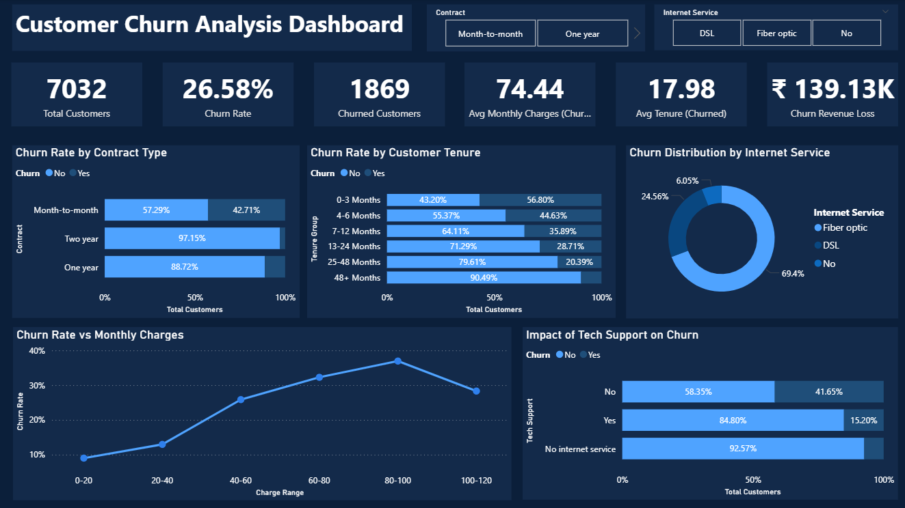

# 📉 Customer Churn Analysis Dashboard

An interactive Power BI dashboard built to analyze customer churn patterns across contract types, tenure groups, internet service, and monthly charges.

---

## Short Description / Purpose

This dashboard helps telecom businesses identify why customers are leaving — by visualizing churn rates across key dimensions like contract type, tenure, internet service, tech support, and monthly charges.

---

## File Format

- `.pbix` — Power BI dashboard template (open in Power BI Desktop)
- `.csv` — Dataset used to build the dashboard
- `.png` — Preview screenshot of the final dashboard

---

## Data Source

- Dataset: Telco Customer Churn Dataset
- Records: 7,043 customers
- Columns: Customer ID, Gender, Senior Citizen, Partner, Dependents, Tenure, Internet Service, Contract, Monthly Charges, Total Charges, Tech Support, Churn
- Source: Publicly available telecom analytics dataset

---

## Features / Highlights

### Business Problem
Customer churn is one of the biggest challenges in the telecom industry. Retaining existing customers is far more cost-effective than acquiring new ones — but without proper analytics, it's difficult to identify at-risk customers before they leave.

### Goal of the Dashboard
To deliver a clear and interactive churn analytics tool that helps stakeholders:
- Monitor overall churn rate and revenue loss
- Identify which contract types and tenure groups are most at risk
- Understand the impact of internet service and tech support on churn
- Analyze the relationship between monthly charges and churn rate

### Walkthrough of Key Visuals

- KPI Cards — Total Customers (7,032), Churn Rate (26.58%), Churned Customers (1,869), Avg Monthly Charges Churned (74.44), Avg Tenure Churned (17.98), Churn Revenue Loss (₹139.13K)
- Churn Rate by Contract Type (Stacked Bar Chart) — Month-to-month contracts have the highest churn at 42.71%, Two-year contracts lowest at 2.85%
- Churn Rate by Customer Tenure (Stacked Bar Chart) — Customers with 0-3 months tenure show the highest churn at 56.80%
- Churn Distribution by Internet Service (Donut Chart) — Fiber optic users account for 69.4% of churned customers
- Churn Rate vs Monthly Charges (Line Chart) — Churn rate peaks at the 80-100 charge range at ~35%
- Impact of Tech Support on Churn (Stacked Bar Chart) — Customers without tech support churn at 41.65% vs only 15.20% with tech support
- Slicers — Filter by Contract Type and Internet Service

### Business Impact & Insights

- Month-to-month contract customers are the highest churn risk — offering incentives to switch to annual plans can significantly reduce churn
- New customers (0-3 months) are most vulnerable — a strong onboarding experience is critical
- Fiber optic users churn the most despite higher charges — service quality and value perception need improvement
- Customers without tech support churn at nearly 3x the rate — bundling tech support can be a powerful retention tool
- High monthly charges (80-100 range) correlate with peak churn — flexible pricing plans could help retain these customers

---

## Screenshots 

